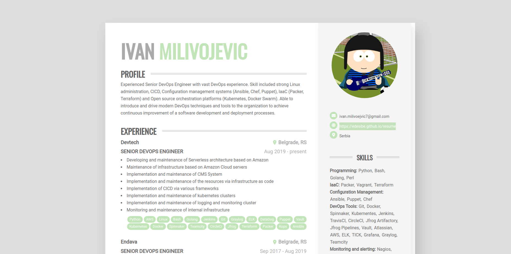

[](https://github-tools.github.io/github-release-notes/)

# Almeida CV Theme
Theme to build a customizeable printable HTML/CSS CV.



# Features
 - Online CV with minor responsiveness
 - Printable as A4 PDF
 - HTML5 + CSS3
 - Customizeable colors

## Print your PDF CV
When printing the page in the browser, you'll get a formatted A4 page that can be used as your PDF resume. 
If your page holds more than 1 A4 page, the content will be divided into the given amount of pages.

For better formatting, you can set the number of pages in the `config.toml` file.


# Download 
Clone the repo: `git clone https://github.com/ineesalmeida/almeida-cv`

# Installation
## Install Hugo
To use almeida-cv theme you need to install Hugo by following https://gohugo.io/getting-started/installing/.

## Fetch submodules

```
git submodule init
git submodule update
git submodule update --remote
git submodule sync
```

## Create your personal website and run
```
hugo new site <your website's name>
cd <your website's name>/themes/
```
Clone the theme (`git clone https://github.com/ineesalmeida/almeida-cv`) into your themes folder.
Replace the files in your root's directory with the ones on `themes/almeida-cv/exampleSite`.
```
hugo server -D
```
The theme is alive on http://localhost:1313/.

## Customization
You can change the theme colors and number of pages in the `config.toml` file.
Your professional data should be added in the `data/content.yaml`.


# Building 
To generate your site in the public folder, execute the following:
```
hugo --minify
```
within the root of your project.

# Deploying on github pages

GH expects content in `/docs` folder in `master` branch.Thus one must update `config.toml` and add 

```
publishDir = "docs"
```

# Contributing 
Post bugs and contributions to the issue tracker. Or make a pull request.
